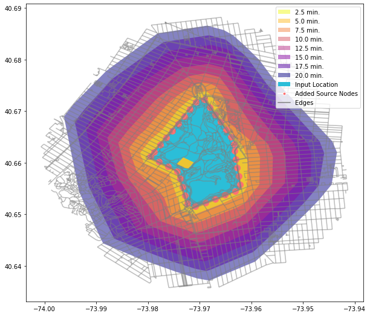

# isolines-examples

This is an examples repository for **isolines** a python library for street networks isolines and isochrones : 
https://github.com/mlichter2/isolines 

**isolines** is a Python library for creating street networks isolines (equal-distance) 
and isochrones (equal-time) polygons with just one line of code. It is built on top of Shapely,
geopandas, NetworkX and osmnx.

**isolines** allows you to create isolines:
* from OSM data **without any data input** or * **use your own data**: your own network and source locations

## Examples include 
* basic examples
* adding isolines and isochrones to an existing instance
* refining isolines' concave boundaries and smoothing
* refining source location geometry
* tweaking location geometry sample interval
* using different data sources
* example using US Census Tiger data
* geometry types
* using local coordinate systems


```python
import isolines as il
df = il.isolines('Prospect Park, Brooklyn, NYC, USA', metric = 'time',values=[3, 6, 9])
df
```
|  | geometry  | time  |
| ------- | --- | --- |
| 0 | POLYGON ((-73.9715 40.6492,... | 3 |
| 1 | POLYGON ((-73.9708 40.6470,... | 6 |
| 2 | POLYGON ((-73.9704 40.6448...	 | 9 |

However, if you which to explore your result with built-in visualization and be able to 
amend them and perform EDA use one of the following classes: ```GpdIsolimes, NXIsoliner, OsmIsolines```
```python
iso = il.OsmIsolines('Prospect Park, Brooklyn, NYC, USA', metric = 'time', values=np.arange(2.5, 22.5, 2.5), unit = 'ft', sample = 600)
iso.plot_isolines(figsize = (10, 10))
```
